# People360 — User Guide

**People360** is the ISKOLARIS desktop application for HR, timekeeping, and payroll. This guide walks through the main screens and everyday tasks, with screenshots taken from the live system.

---

## Table of Contents

1. [Getting Started](#1-getting-started)
2. [Signing In](#2-signing-in)
3. [Navigation](#3-navigation)
4. [Dashboard](#4-dashboard)
5. [Administration](#5-administration)
6. [Human Resource](#6-human-resource)
7. [Timekeeping](#7-timekeeping)
8. [Payroll](#8-payroll)
9. [Common Tasks](#9-common-tasks)
10. [Tips & Troubleshooting](#10-tips--troubleshooting)

---

## 1. Getting Started

### Desktop app (client deployment)

People360 ships as a **single installer** — no separate PHP, MySQL, or web server setup.

| Platform | Installer |
|----------|-----------|
| macOS (Apple Silicon) | `People360-<version>-arm64.dmg` |
| Windows | `People360-<version>-setup.exe` |

**First launch**

1. Double-click the People360 app icon.
2. The app creates its local database automatically (SQLite).
3. Migrations and reference data run in the background.
4. The login screen opens when ready.

> **macOS unsigned builds:** If the app is blocked, right-click → **Open**, or allow it in **System Settings → Privacy & Security**.

### Development / browser access

For internal testing, developers can run `php artisan serve` and open `http://127.0.0.1:8000`.

---

## 2. Signing In

Open People360 and enter your email and password on the sign-in screen.

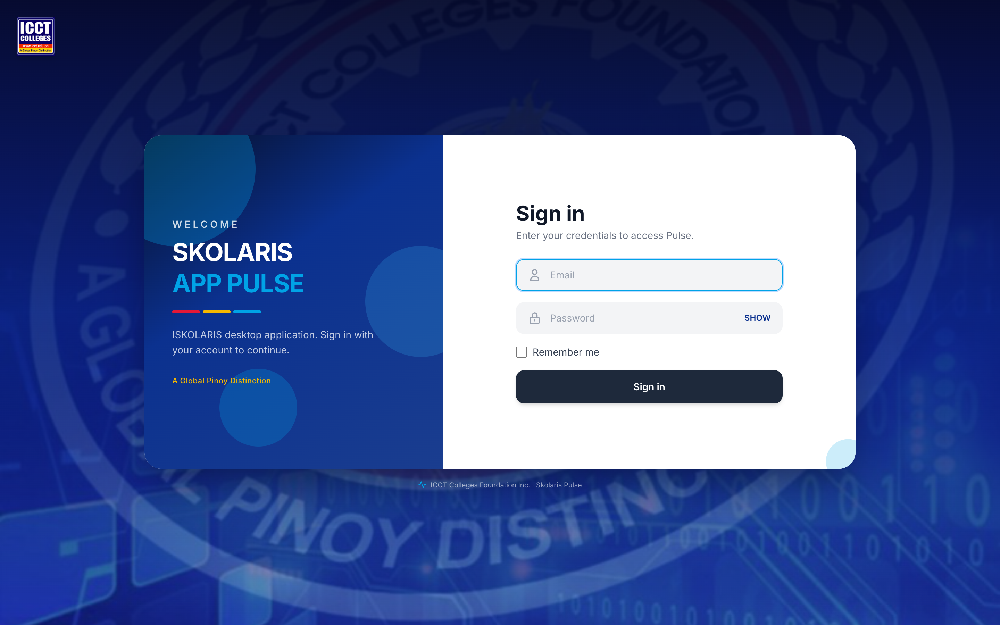

| Field | Desktop default (first install) |
|-------|----------------------------------|
| Email | `superadmin@icct.edu.ph` |
| Password | `Password123!` |

- Check **Remember me** to stay signed in on the same machine.
- Click **SHOW** to reveal the password while typing.
- Contact your administrator if you cannot sign in or need access to more modules.

---

## 3. Navigation

After login, the **sidebar** on the left lists all modules you are allowed to access.

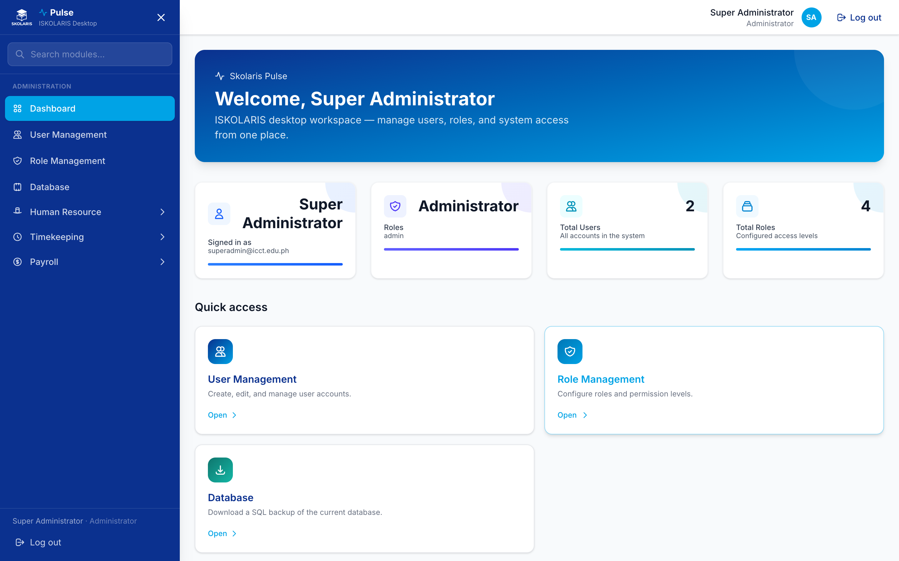

| Area | What you see |
|------|----------------|
| **Search modules** | Filter the sidebar by module name |
| **Administration** | Dashboard, User Management, Role Management, Database |
| **Human Resource** | Employees and HR lookup tables (expand the section) |
| **Timekeeping** | Policy, Time Logs, Employee Profile, Employee Load |
| **Payroll** | Rate Definition, Maintenance Table, Government Tables, Calendar, Transaction |
| **User footer** | Your name, role, and **Log out** |

### Modal-based actions

Most **Add**, **Edit**, and **View** actions open a **modal dialog** on the same page — the app does not navigate to a separate full-page form. Look for buttons such as **Add Employee**, **Upload**, or row **View / Edit** icons.

### Search and tables

List pages include:

- A **search box** (filters as you type)
- **Show: N per page** dropdown
- Row actions: **View**, **Edit**, **Delete** (when your role allows)

---

## 4. Dashboard

The Dashboard is your home screen after login.


**Summary cards** show:

- Signed-in user and email
- Assigned role(s)
- Total users and roles (administrators only)

**Quick access** (administrators) links to User Management, Role Management, and Database backup.

---

## 5. Administration

> Available to **Administrator** role by default.

### User Management

Create and maintain user accounts (name, email, password, assigned roles).

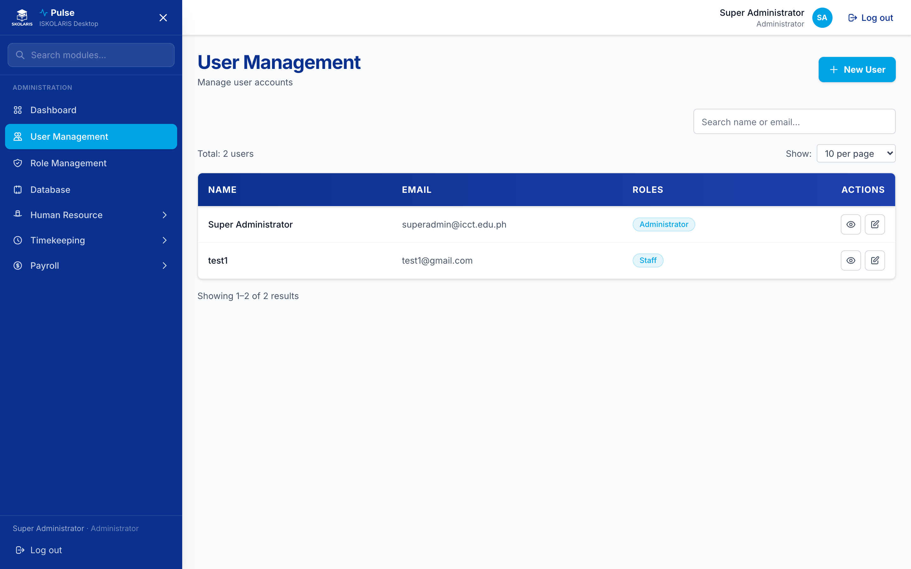

| Action | How |
|--------|-----|
| Add user | **New User** button → fill modal → Save |
| Edit user | Row **Edit** → update fields → Save |
| View user | Row **View** → read-only modal |
| Delete user | Row **Delete** → confirm (soft delete) |

### Role Management

Define roles and which modules each role can access (view, create, update, delete).

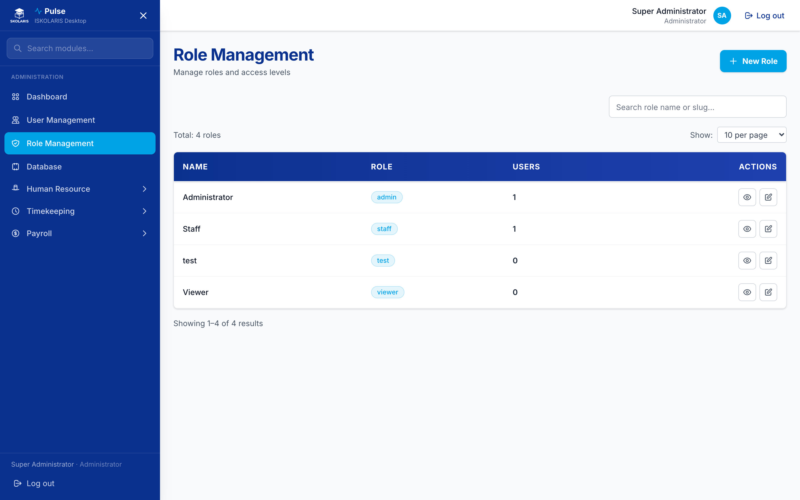

| Action | How |
|--------|-----|
| New role | **New Role** → name, slug, module permissions |
| Edit permissions | **Edit** on a role → toggle module/sub-module access |
| Assign members | Add users to a role from the role edit modal |

**Built-in roles:** Administrator, Staff, Viewer.

### Database backup

Download a full SQL backup before reinstalling or moving data to another machine.

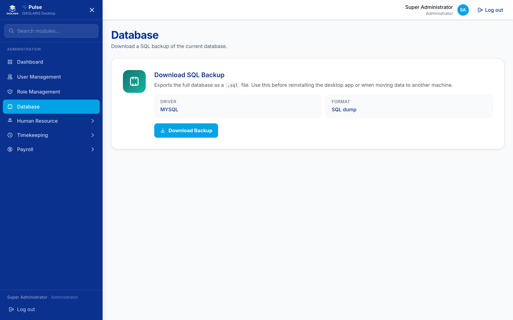

1. Open **Database** from the sidebar or Dashboard quick access.
2. Click **Download Backup**.
3. Save the `.sql` file in a safe location.

---

## 6. Human Resource

### Employees

Manage employee master records — personal info, employment, salary, and compliance.

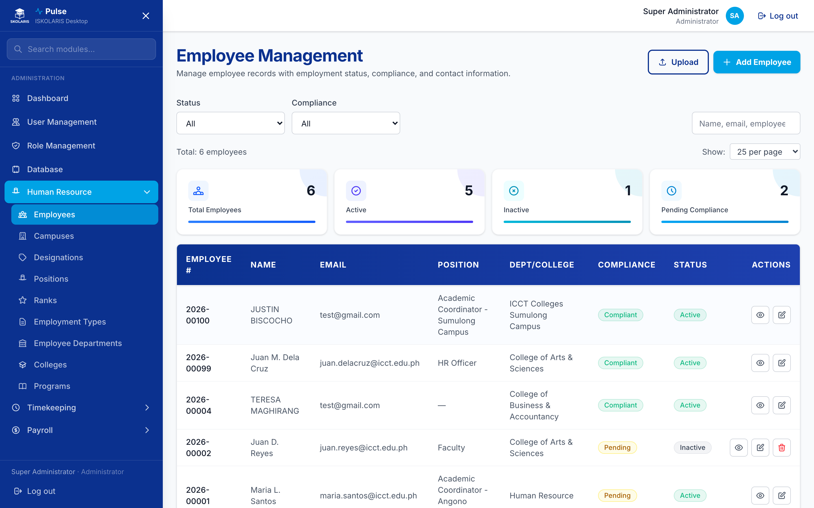

| Action | How |
|--------|-----|
| Add employee | **Add Employee** → wizard (campus, then details) |
| Upload bulk | **Upload** → download template → fill CSV/XLSX → upload → preview → commit |
| Search / filter | Search bar; filter by status and compliance |
| View / Edit | Row actions open modals |

**Upload flow**

1. Click **Upload**.
2. Download the template.
3. Fill in employee rows (use valid campus codes, pay types, and roles from your database).
4. Upload the file → review valid rows and errors in the preview modal.
5. **Commit** to import, or **Discard** to cancel.

Sample files: `docs/samples/employee-upload-sample.csv`

### HR lookup tables

Maintain reference data used across the system.

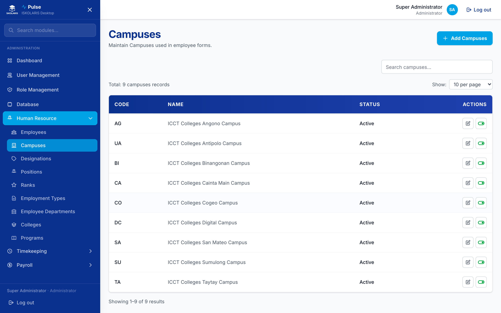

| Submodule | Purpose |
|-----------|---------|
| Campuses | Campus codes and names |
| Designations | Job designations |
| Positions | Position titles |
| Ranks | Employee ranks |
| Employment Types | Regular, contractual, etc. |
| Employee Departments | Organizational units |
| Colleges | Colleges per campus |
| Programs | Academic programs |

Each lookup supports **Add**, **Edit**, **View**, **Toggle status**, and **Delete** (soft delete) via modals.

---

## 7. Timekeeping

### Timekeeping Policy

Configure how attendance is interpreted — tardiness, overtime, breaks, night differential, and related settings.

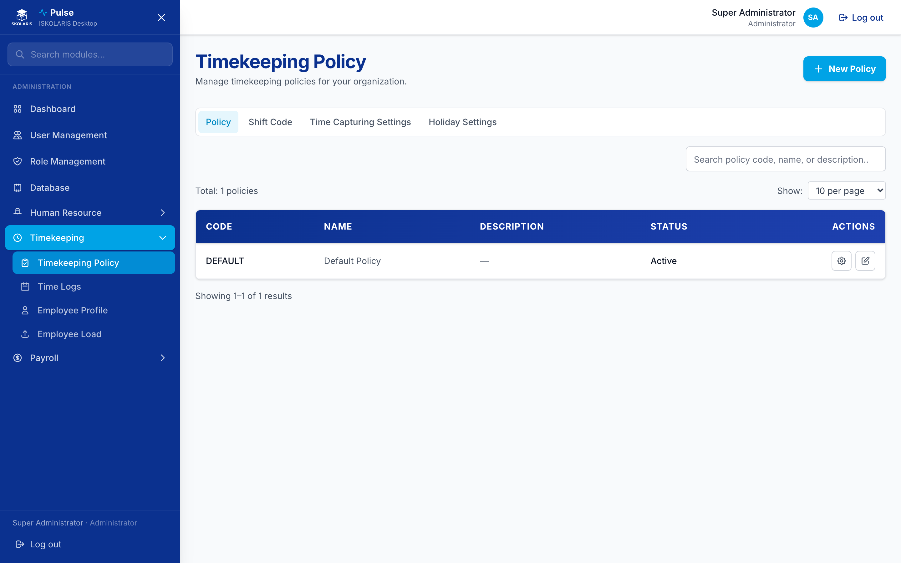

**Module tabs**

| Tab | Purpose |
|-----|---------|
| **Policy** | Main timekeeping policies and per-policy settings |
| **Shift Code** | Employee shift definitions |
| **Time Capturing Settings** | Biometric / file upload formats |
| **Holiday Settings** | Holiday groups and yearly holiday lists |

**Policy settings tabs** (inside a policy): Tardiness and Undertime, Overtime, Breaks, Night Differential, General.

Use **Add Policy** to create a new policy, then open it to configure each settings tab.

### Time Logs

Upload raw time-in/time-out or DTR files from biometric devices.

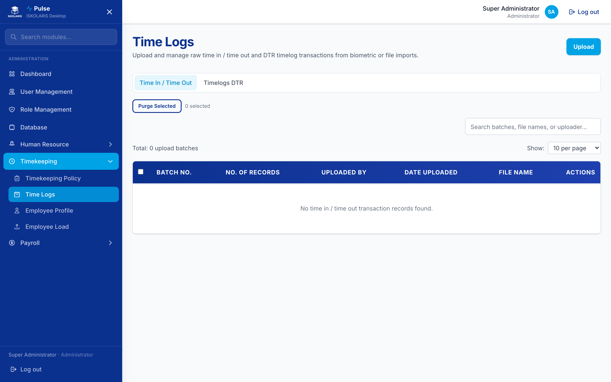

| Tab | Purpose |
|-----|---------|
| **Time In / Time Out** | Standard punch uploads |
| **Timelogs DTR** | DTR format uploads (select campus: SA, SU, CA) |

**Upload flow**

1. Click **Upload**.
2. Select the time capture format.
3. Download the template if needed.
4. Upload the file → preview → **Commit** or **Discard**.
5. View a batch with **View** to see imported records.

Sample files: `docs/samples/time-logs-staff-sample.txt`

### Employee Profile

Assign timekeeping settings per employee — holiday group, shift code, policy, and rest days.

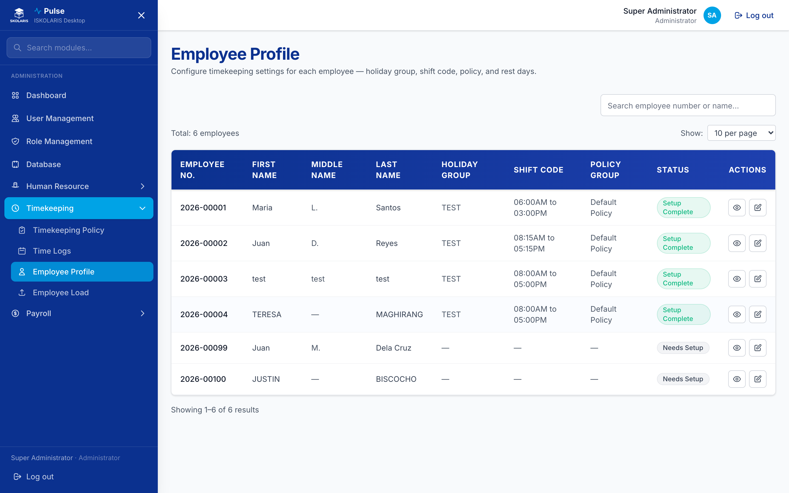

1. Find the employee in the list.
2. Click **Setup** (or **View**) on the row.
3. Configure holiday group, shift, policy, and rest days.
4. Save.

### Employee Load

Upload faculty teaching load with time-in/time-out per subject schedule.

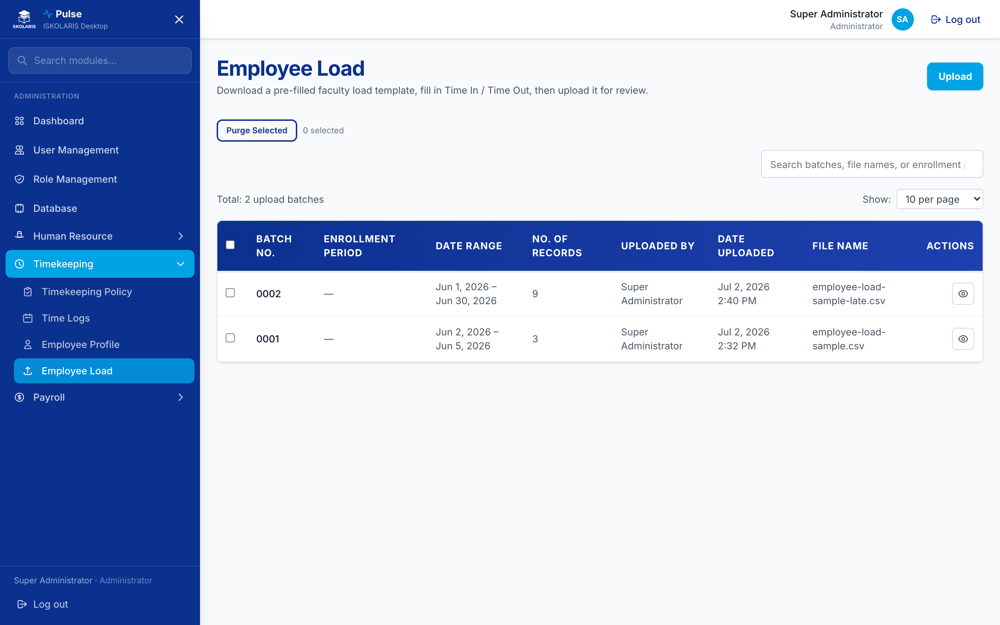

1. Click **Upload**.
2. Select a date range and download the pre-filled template.
3. Fill in Time In / Time Out per load row.
4. Upload → preview → **Commit**.

Sample files: `docs/samples/employee-load-sample.csv`

---

## 8. Payroll

Set up payroll before running batches: rate definitions → maintenance tables → government tables → calendar → transaction.

### Rate Definition

Define how pay is calculated by day type and time type.

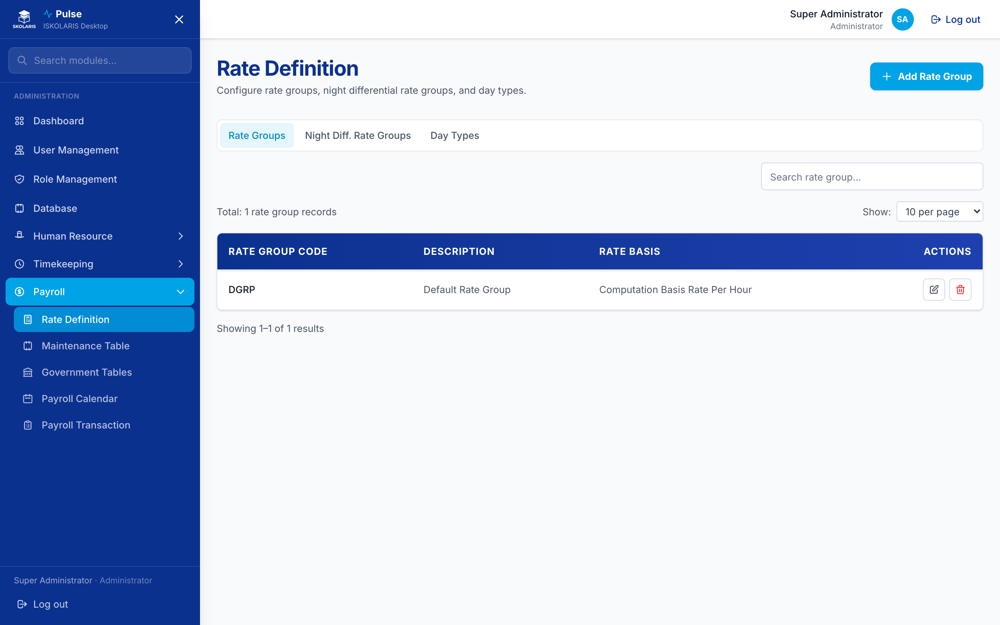

| Tab | Purpose |
|-----|---------|
| **Rate Groups** | Regular pay rates by day type |
| **Night Diff. Rate Groups** | Night differential rates and time window |
| **Day Types** | REGU, REST, holiday types, etc. |

### Maintenance Table

Configure income types, deduction types, loan types, and leave types used in payroll.

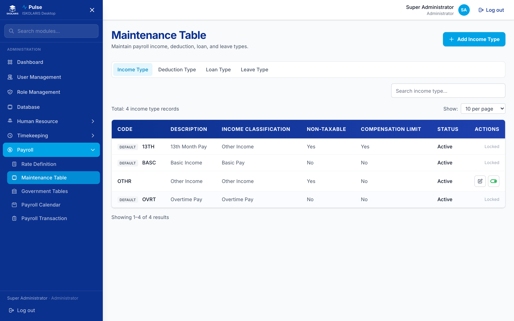

| Tab | Examples |
|-----|----------|
| Income Type | BASC, OVRT, NDIF |
| Deduction Type | SSS, PhilHealth, Pag-IBIG, LTDE, UTDE |
| Loan Type | SSS loan, Pag-IBIG loan |
| Leave Type | VL, SL, tardiness leave types |

> System default records (e.g. BASC, government premiums) cannot be deleted or deactivated.

### Government Tables

Maintain statutory contribution and tax tables.

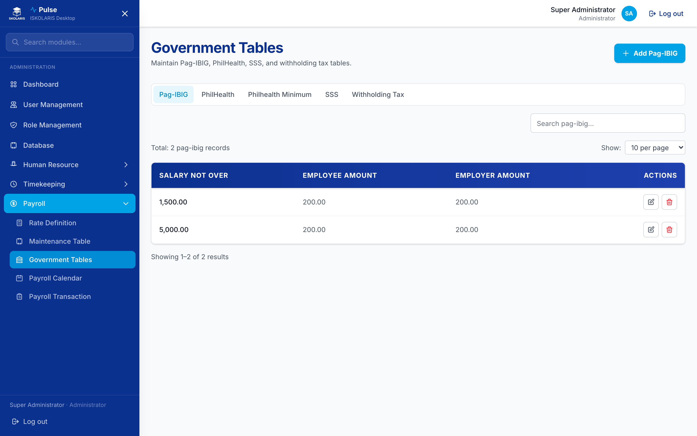

| Tab | Content |
|-----|---------|
| Pag-IBIG | Contribution brackets |
| PhilHealth | Premium tables |
| Philhealth Minimum | Minimum premium rules |
| SSS | SSS contribution table |
| Withholding Tax | BIR 2023 withholding tax grids |

### Payroll Calendar

Define pay periods per pay type (Daily, Weekly, Semi-Monthly, Monthly).

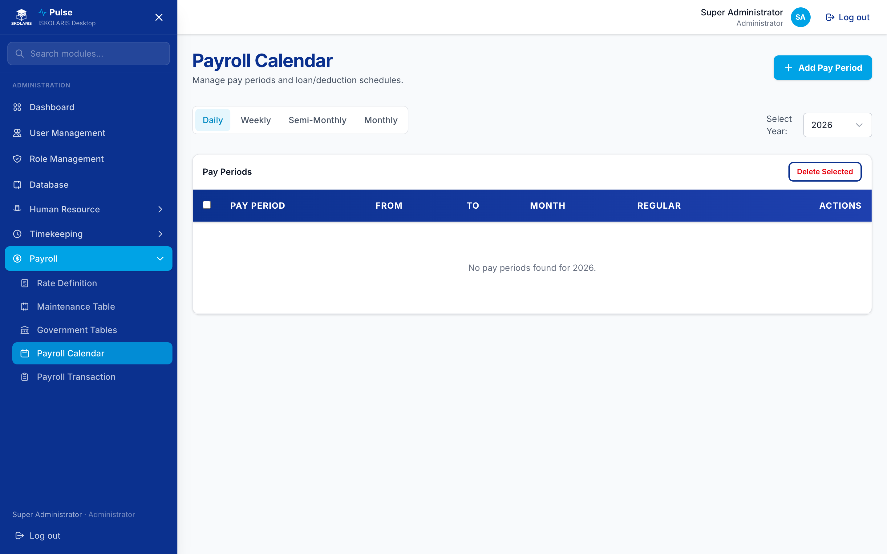

1. Select pay type tab (e.g. **Semi-Monthly**).
2. Select year.
3. **Add Pay Period** or use **Autofill** to generate periods.
4. Optionally set loan/deduction schedules per period.

### Payroll Transaction

Process payroll batches end to end.

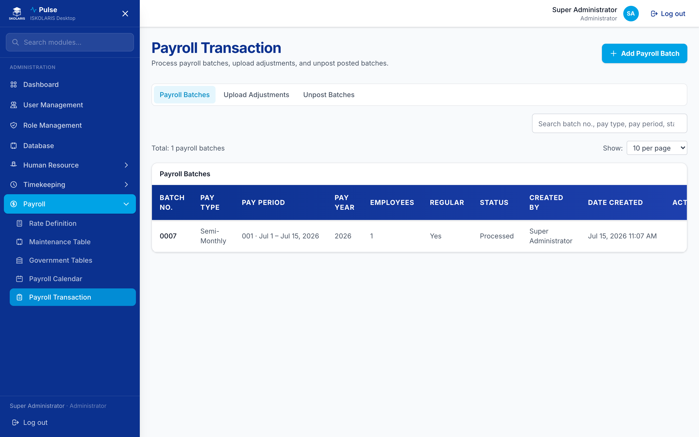

**Module tabs**

| Tab | Purpose |
|-----|---------|
| **Payroll Batches** | Create and process batches |
| **Upload Adjustments** | Upload incomes, deductions, or hours worked |
| **Unpost Batches** | Reverse posted batches when corrections are needed |

#### Payroll batch workflow

```
Create batch → Add employees → Process → Review → Post
```

| Step | Action |
|------|--------|
| 1. Create | **Add Payroll Batch** → pay type, pay period, regular/adjustment |
| 2. Add employees | Open batch → **Add Employees** → select from list |
| 3. Upload hours | **Upload Adjustments → Hours Worked** — primary hours source (no Time Logs upload yet) |
| 4. Process | **Process** — computes incomes, deductions, govt premiums, tax |
| 5. Review | Open employee row → tabs: **Incomes**, **Deductions**, **Net Pay** |
| 6. Adjust (optional) | Add manual income/deduction lines in employee detail |
| 7. Reprocess | **Reprocess** after changes or new uploads |
| 8. Post | **Post** to finalize the batch |
| 9. Unpost | Use **Unpost Batches** tab if corrections are required |

**Upload Adjustments sub-tabs**

| Sub-tab | Upload content |
|---------|----------------|
| **Incomes** | Income type, taxable / non-taxable amounts |
| **Deductions** | Deduction type, employee/employer amounts, hours (for LTDE/UTDE) |
| **Hours Worked** | Day type, time type, number of hours (amount computed at process) |

Sample files:

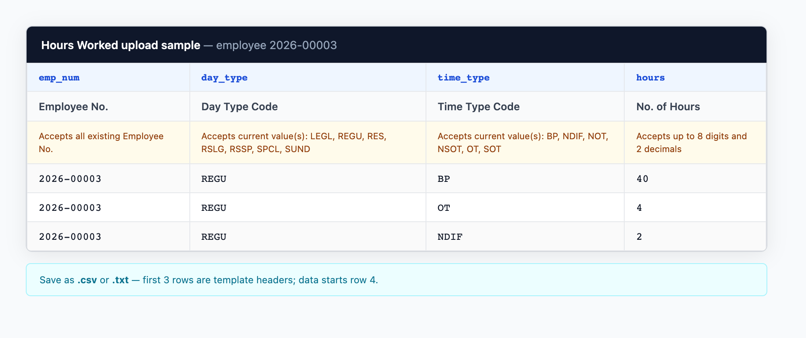

*Figure 55 — Sample Hours Worked upload for employee `2026-00003` (REGU/BP 40h, REGU/OT 4h, REGU/NDIF 2h). Save as `.csv` or `.txt`.*

- `docs/samples/income-adjustment-upload-sample.txt`

---

## 9. Common Tasks

### Run semi-monthly payroll (typical flow)

**Sa ngayon:** Hindi pa ginagamit ang **Time Logs** upload. Ang hours para sa payroll ay mula sa **Upload Adjustments → Hours Worked**.

1. **Employee Profile** — confirm shift, policy, holiday group, and rest days per employee.
2. **Payroll Transaction → Upload Adjustments → Hours Worked** — upload hours per employee for the pay period (Day Type, Time Type, No. of Hours). See sample image in Section 9.
3. **Payroll Transaction → Payroll Batches** — create batch for the correct semi-monthly period.
4. Add employees → **Process** → review **Net Pay** per employee.
5. **Reprocess** if you upload more hours or add manual adjustments.
6. **Post** when totals are correct.

**Kapag naka-enable na ang Time Logs:** Upload punches first; log hours merge with uploaded Hours Worked at **Process**.

### Add a new employee manually

1. **Human Resource → Employees → Add Employee**.
2. Complete campus and employee details in the wizard.
3. Go to **Timekeeping → Employee Profile** and run **Setup** for that employee.

### Grant a staff user access to Payroll only

1. **Role Management → Edit** (or create a role).
2. Enable **Payroll** sub-modules (view/create/update as needed).
3. **User Management → Edit** user → assign the role.

### Back up before desktop reinstall

1. **Database → Download Backup**.
2. Install the new People360 version.
3. Restore data per your IT procedure (or contact support).

---

## 10. Tips & Troubleshooting

| Issue | What to try |
|-------|-------------|
| Empty pay type dropdown | Restart the desktop app — reference data auto-repairs on launch |
| Upload preview shows errors | Check campus codes, employee numbers, and type codes against lookup tables |
| Batch shows wrong hours/amount | Re-upload adjustments, then **Reprocess** the batch |
| Module missing from sidebar | Ask admin to check **Role Management** permissions |
| macOS blocks the app | Right-click app → **Open** once, then allow in Privacy & Security |

### Audit trail

All create, update, and delete actions are recorded in the system audit log (`sys_logs`) for accountability.

### Regenerating guide screenshots

Developers can refresh screenshots after UI changes:

```bash
cd pulse
node scripts/capture-user-guide-screenshots.mjs
```

Requires Google Chrome installed on the machine. Uses the running dev server at `http://127.0.0.1:8000` by default.

---

## Document info

| Item | Value |
|------|-------|
| App | People360 (ISKOLARIS Desktop) |
| Screenshots | Captured from live People360 UI |
| Last updated | July 15, 2026 |

For technical setup and build instructions, see [`pulse/README.md`](../../README.md).
